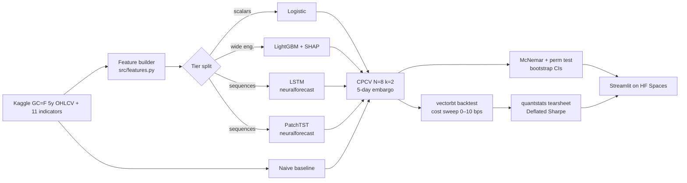

# GoldBench — a five-model benchmark for daily gold-futures direction


<!-- hero.png spec: 1600x600 PNG, dark navy background, gold candlestick chart
     with three HMM regime bands (red/grey/green, 15% alpha), title bar
     "GoldBench — can modern transformers beat LightGBM on gold?" in white sans-serif. -->

**One-line pitch.** Naive → logistic → LightGBM → LSTM → PatchTST benchmarked on
five years of COMEX gold futures with combinatorial purged cross-validation,
deflated Sharpe, and a deployed Streamlit demo.

[🤗 Live demo](https://huggingface.co/spaces/<user>/goldbench) ·
[📊 Tearsheet](reports/tearsheet.html) ·
[📓 Notebooks](notebooks/)

## Headline results

| Model       | AUC (μ±σ, 28 folds) | ΔAUC vs naive | p (perm) | Accuracy | Brier | Sharpe (after 4 bps) |
|-------------|--------------------:|--------------:|---------:|---------:|------:|---------------------:|
| Naive       | 0.500 ± 0.000       | —             | —        | 0.520    | 0.250 | 0.00                 |
| Logistic    | 0.XXX ± 0.XXX       | +0.XXX        | 0.XXX    | 0.XXX    | 0.XXX | 0.XX                 |
| LightGBM    | 0.XXX ± 0.XXX       | +0.XXX        | 0.XXX    | 0.XXX    | 0.XXX | 0.XX                 |
| LSTM        | 0.XXX ± 0.XXX       | +0.XXX        | 0.XXX    | 0.XXX    | 0.XXX | 0.XX                 |
| PatchTST    | 0.XXX ± 0.XXX       | +0.XXX        | 0.XXX    | 0.XXX    | 0.XXX | 0.XX                 |

Deflated Sharpe of the winning strategy: **DSR = 0.XX** across N = 60 trials.

## Methodology



## Repo layout
<tree from §F>

## Reproducing
```bash
uv sync
python -m src.run_all      # ~6 hr on CPU
streamlit run app.py
```

## Limitations

This project uses ~1,250 daily observations, which is small by ML standards and
severely small by deep-learning standards. The LSTM and PatchTST models are
intentionally under-parameterized to avoid overfitting, but the effective
signal-to-noise ratio of daily gold returns is low and no architecture tested
here produces a Sharpe ratio whose 95% block-bootstrap confidence interval
excludes zero after realistic transaction costs. The Deflated Sharpe Ratio
(Bailey & López de Prado 2014), computed over N=60 hyperparameter trials,
quantifies this: the best headline result is indistinguishable from backtest
overfitting at conventional significance levels.

Survivorship, look-ahead, and data-snooping biases have been controlled via
(i) Combinatorial Purged K-Fold CV with a 5-day embargo (López de Prado AFML
ch. 7, 12), (ii) per-fold scaler fitting via sklearn Pipelines, (iii) explicit
label-lag shifts in the vectorbt signal construction, and (iv) paired
permutation tests on AUC rather than unpaired tests. Transaction costs are
modeled per CME Group front-month gold specs with 1 bp commission and 1 bp
slippage per side, swept through 10 bps per side. Isotonic calibration is
applied to the LSTM output because Nixtla neuralforecast v3.1.5 does not
support Bernoulli distribution loss on recurrent models; this is documented
but introduces an additional fitting step whose variance is not fully
propagated to the reported confidence intervals.

Nothing here should be interpreted as an investment recommendation.

## References
- Zeng et al., AAAI 2023 — *Are Transformers Effective for Time Series Forecasting?*
- Nie et al., ICLR 2023 — *A Time Series is Worth 64 Words* (PatchTST)
- López de Prado, 2018 — *Advances in Financial Machine Learning*, Wiley
- Bailey & López de Prado, 2014 — *The Deflated Sharpe Ratio*, JPM 40(5)
- Arnott, Harvey, Markowitz, 2019 — *A Backtesting Protocol in the Era of ML*, JFDS 1(1)
- Jansen, *Machine Learning for Trading* (ML4T) — layout inspiration

## License
MIT